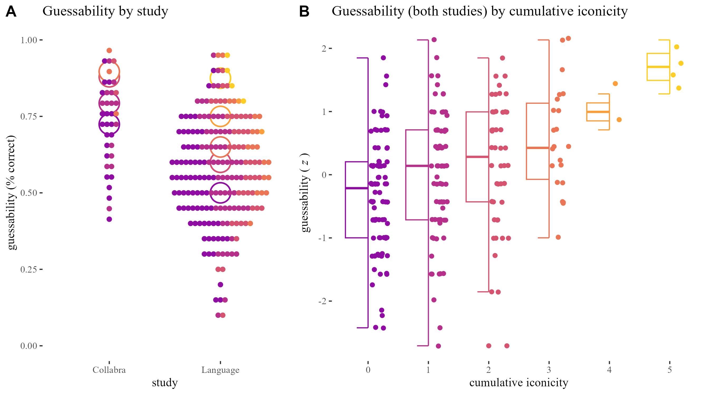

# Triangulating iconicity

Open data, analyses & supplementary materials for a paper on the relation between form and meaning in iconic words. We look at the iconicity of 239 ideophones from 5 languages in three ways: (i) using experimental measures of their guessability; (ii) coding structural correspondences between aspects of form and meaning; and (iii) collecting subjective iconicity ratings. We triangulate these measures to contribute to a more holistic, empirically grounded, theoretically informed, experimentally robust understanding of iconicity.

## Files

Methods and results:
* A code notebook recording the coding consistency procedure: [rendered for github](paper_01_consistency.md), [.Rmd source](paper_01_consistency.Rmd)
* A code notebook recording the visual and statistical analyses: [rendered .md](paper_02_main_analyses.md), [.Rmd source](paper_02_main_analyses.Rmd)
* A code notebook recording further exploratory analyses ([.R source](paper_03_exploratory_analyses.R))
* A [shiny app](https://bonnie-mclean.shinyapps.io/triangulatingiconicity/) to explore the dataset ([R source](app.R))

Data files:
* [ideophones_coded.xlsx](data/ideophones_coded.xlsx): main coding data file for analysis in Study A (.csv version in `ideophones_coded_guessed_rated.csv`)
* [ideophones_rated.csv](data/ideophones_rated.csv): main ratings data file for anaysis in Study B, one row for each rating of an ideophone by a participants ([.xlsx version](data/ideophones_rated.xlsx) generated by Qualtrics)
* [ideophones_coded_guessed_rated.csv](data/ideophones_coded_guessed_rated.csv): main data file, one row for each ideophone ([.xlsx version](data/ideophones_coded_guessed_rated.xlsx))
* [predico_coding_scheme_2.pdf](data/predico_coding_scheme_2.pdf): main coding scheme ([.docx version](data/predico_coding_scheme_2.docx))
