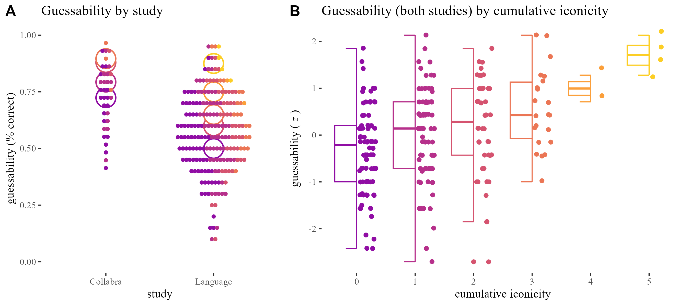

# The Anatomy of Iconicity

Open data, analyses & supplementary materials for a paper on the relation between form and meaning in iconic words. We look at the iconicity of 239 ideophones from 5 languages in three ways: (i) using experimental measures of their guessability; (ii) coding structural correspondences between aspects of form and meaning; and (iii) collecting subjective iconicity ratings. We triangulate these measures to contribute to a more holistic, empirically grounded, theoretically informed, experimentally robust understanding of iconicity. Read the paper:

> Punselie, S., McLean, B., & Dingemanse, M. (2024). The Anatomy of Iconicity: Cumulative Structural Analogies Underlie Objective and Subjective Measures of Iconicity. *Open Mind*, 8, 1191–1212. doi: [10.1162/opmi_a_00162](https://doi.org/10.1162/opmi_a_00162)

## Files

Methods and results: 
* An R script for data processing: [paper_00_data_processing.R](paper_00_data_processing.R)
* A code notebook recording the coding consistency procedure: [rendered for github](paper_01_consistency.md), [.Rmd source](paper_01_consistency.Rmd)
* A code notebook recording the visual and statistical analyses: [rendered for github](paper_02_main_analyses.md), [.Rmd source](paper_02_main_analyses.Rmd)
* A code notebook recording further exploratory analyses ([.R source](paper_03_exploratory_analyses.R))
* A script for producing publication-quality plots ([.R source](paper_04_publication_quality_plots.R))
* A [shiny app](https://bonnie-mclean.shinyapps.io/triangulatingiconicity/) to explore the dataset ([R source](app.R))

Data files: 
* [ideophones_coded.xlsx](data/ideophones_coded.xlsx): main coding data file for analysis in Study A (.csv version in `ideophones_coded_guessed_rated.csv`)
* [ideophones_rated.csv](data/ideophones_rated.csv): main ratings data file for anaysis in Study B, one row for each rating of an ideophone by a participants ([.xlsx version](data/ideophones_rated.xlsx) generated by Qualtrics)
* [ideophones_coded_guessed_rated.csv](data/ideophones_coded_guessed_rated.csv): main data file, one row for each ideophone ([.xlsx version](data/ideophones_coded_guessed_rated.xlsx))
* [predico_coding_scheme_2.pdf](data/predico_coding_scheme_2.pdf): main coding scheme ([.docx version](data/predico_coding_scheme_2.docx))

Stimuli:
* [stimuli](stimuli): audio files for the 38 [Collabra](stimuli/Collabra_audiofiles) and 203 [Language](stimuli/Language_audiofiles) sets of ideophones (.wav format).

These are included here for convenience and also available from the original studies, which included open data:
* Lockwood, G., Hagoort, P., & Dingemanse, M. (2016). How iconicity helps people learn new words: neural correlates and individual differences in sound-symbolic bootstrapping. *Collabra: Psychology*, 2(1), 1–15. doi: 10.1525/collabra.42 [OSF repository](https://osf.io/ema3t/) 
* Dingemanse, M., Schuerman, W., Reinisch, E., Tufvesson, S., & Mitterer, H. (2016). What sound symbolism can and cannot do: testing the iconicity of ideophones from five languages. *Language*, 92(2), e117–e133. doi: 10.1353/lan.2016.0034 [OSF repository](https://osf.io/cwmzr/)
