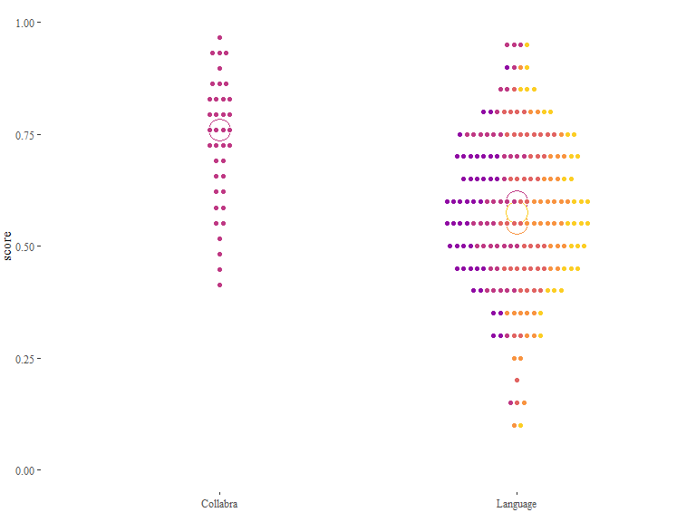
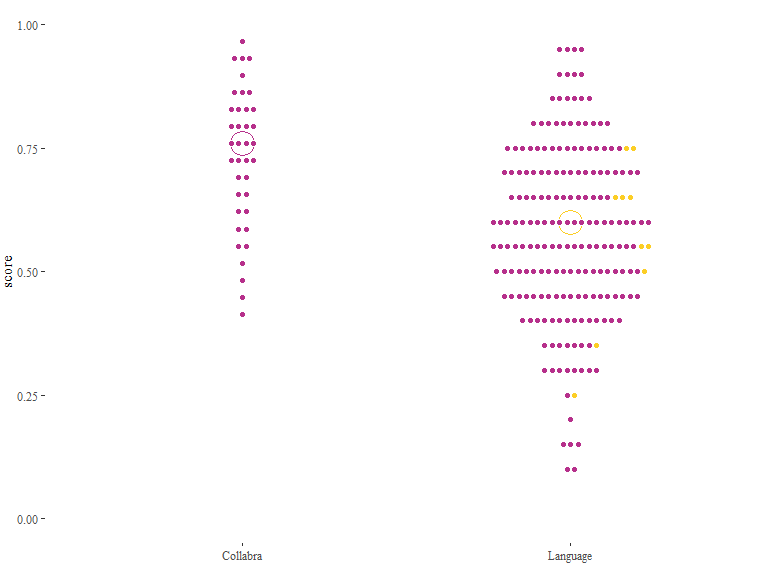
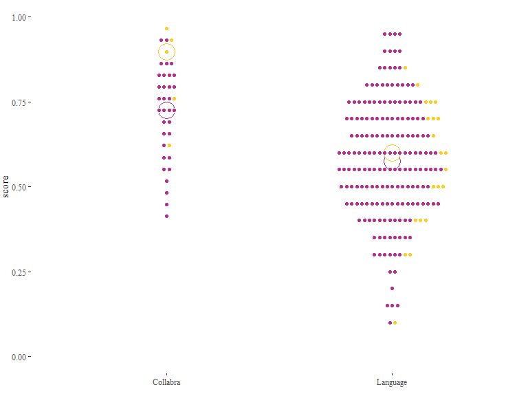
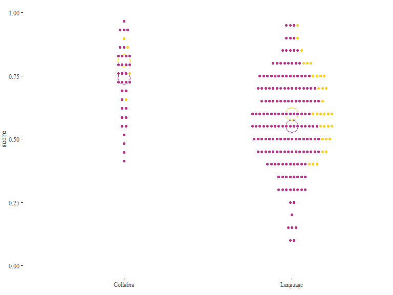
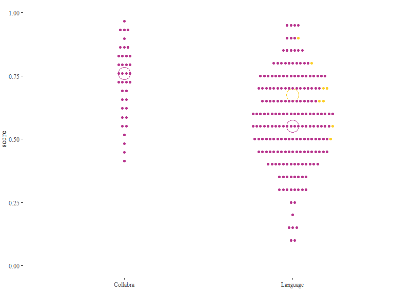

Triangulating iconicity: From structure mapping to guessability
================
Mark Dingemanse & Stella Punselie
Updated 2020-06-17

Code notebook for a study of the relation between linguistically
informed iconicity coding and experimentally collected guessability
scores.

## Setup

``` r
# Packages
list.of.packages <- c("tidyverse","readxl","writexl","ggthemes","viridis","lme4","VGAM")
new.packages <- list.of.packages[!(list.of.packages %in% installed.packages()[,"Package"])]
if(length(new.packages)) install.packages(new.packages)
lapply(list.of.packages, require, character.only=T)

# useful functions
`%notin%` <- function(x,y) !(x %in% y) 
mean.na <- function(x) mean(x, na.rm = T)
sd.na <- function(x) sd(x, na.rm = T)

# custom functions
source("TI_functions.R")
```

## Data

Here we load the ground truth version of the coded data and add the
independently collected guessability scores from the 2016 Collabra and
Language papers.

``` r
# get coding data
d = read_excel("data\\ideophones_coded.xlsx") %>% arrange(filename)

coding_categories <- d %>% dplyr::select(matches('_'),-matches('notes|meaning')) %>% names()

# add guessability scores from the Collabra and Language studies.

d.scores = read_excel("data\\ideophones_guessability.xlsx") %>%
  dplyr::select(-category)
d <- left_join(d,d.scores,by=c("ideophone","language","study" = "paper"))

# add logodds (for when we run stats: it's more sensible to predict against logodds than raw proportion correct)
d <- d %>%
  group_by(study) %>%
  mutate(logodds = probitlink(score))
```

We add congruency measures that link F and M elements.

  - TO DISCUSS: We need to think about the evidential value of each of
    the congruency measures. Most apply to many words, which is good. If
    some of them only capture a few (as `C_durative` and `C_weight_tone`
    seem to do), they are not so interesting because they don’t really
    capture recurring iconic mappings in the data. On the other hand, we
    also have to

<!-- end list -->

``` r
# using ifelse() statements that essentially say, if these conditions are true, use 1, otherwise 0
d <- d %>%
  mutate(C_modality = ifelse(M_sound == 1,1,0),
         C_iterative = ifelse(F_redup == 1 & M_distribution == 1,1,0),
         C_irregular = ifelse(F_redupmod == 1 & M_irregular == 1,1,0),
         C_closure = ifelse(F_closedsyllable == 1 & M_abrupt == 1,1,0),
         C_punctual = ifelse(F_monosyllabic == 1 & M_punctual == 1,1,0),
         C_durative = ifelse(F_finallength == 1 & M_durative == 1,1,0),
         C_weight_voice = ifelse((F_voice == 0 & M_weight == 0) | (F_voice == 2 & M_weight) == 2,1,0),
         C_weight_vowel = ifelse((F_vowelquality == 0 & M_weight == 0) | (F_vowelquality == 2 & M_weight == 2),1,0),
         C_weight_tone = ifelse((F_intonation == 0 & M_weight == 2) | (F_intonation == 2 & M_weight == 0),1,0)
         ) %>%
  mutate(C_cumulative = C_modality + C_iterative + C_irregular + C_closure + C_punctual + C_durative + C_weight_voice + C_weight_vowel + C_weight_tone)

d %>%
  group_by(C_cumulative) %>%
    summarise(n=n())
```

    ## # A tibble: 6 x 2
    ##   C_cumulative     n
    ##          <dbl> <int>
    ## 1            0    97
    ## 2            1    73
    ## 3            2    42
    ## 4            3    23
    ## 5            4     2
    ## 6            5     2

## Plots

A quick first look at some congruency measures. Uses a custom plotting
function `icoplot()`, which is a wrapper for a ggplot object constructed
with `geom_dotplot`.

``` r
# make a copy dp of the data in which we convert some measures to factors for easy plotting & facetting
tofactors <- paste(c("language|category|study|group",names(d[grep('C_',names(d))])),collapse = "|")
dp <- d
dp[,grep(tofactors,names(dp))] <- lapply(dp[,grep(tofactors,names(dp))], as.factor)

# all data points by language
icoplot()
```

    ## [1] "No variable specified"
    ## [1] "Plotting language"

<!-- -->

``` r
icoplot("C_modality")
```

    ## [1] "Plotting C_modality"

<!-- -->

``` r
icoplot("C_iterative")
```

    ## [1] "Plotting C_iterative"

<!-- -->

``` r
icoplot("C_irregular")
```

    ## [1] "Plotting C_irregular"

<!-- -->

``` r
icoplot("C_punctual")
```

    ## [1] "Plotting C_punctual"

<!-- -->

``` r
icoplot("C_durative")
```

    ## [1] "Plotting C_durative"

<!-- -->

``` r
icoplot("C_weight_voice")
```

    ## [1] "Plotting C_weight_voice"

<!-- -->

``` r
icoplot("C_weight_vowel")
```

    ## [1] "Plotting C_weight_vowel"

<!-- -->

``` r
icoplot("C_weight_tone")
```

    ## [1] "Plotting C_weight_tone"

<!-- -->

``` r
icoplot("C_cumulative")
```

    ## [1] "Plotting C_cumulative"

<!-- -->

``` r
# blank plot can be useful as background for slides
ggplot(data=dp, aes(x=study,y=score)) +
  theme_tufte() + ylim(0,1) + theme(legend.position="none",axis.title.x=element_blank(),plot.margin=margin(0,0,10,0)) + 
  stat_summary(fun.y=median,geom="point",size=8,shape=21,stroke=1,fill="white",colour="#c9c9c9") +
  geom_dotplot(colour="white",fill="#c9c9c9",stackgroups=T,dotsize=1.5,binwidth=0.01,binaxis="y",stackdir = "center")
```

<!-- -->
