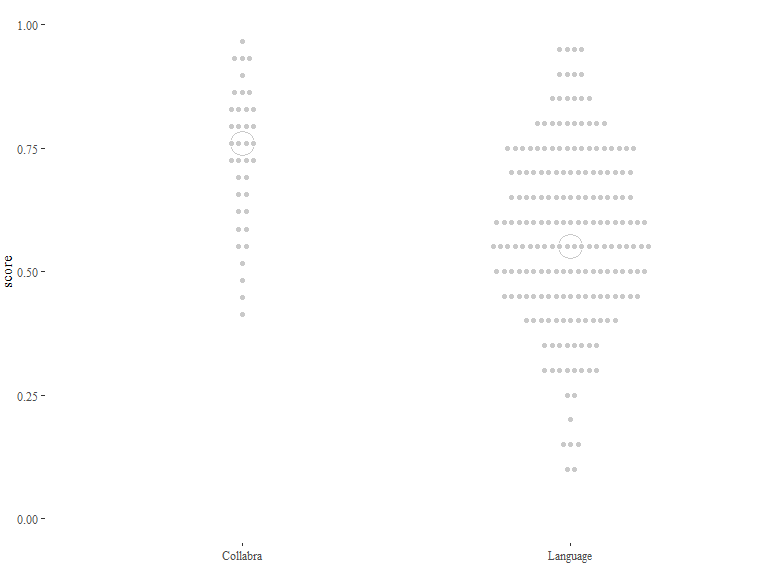
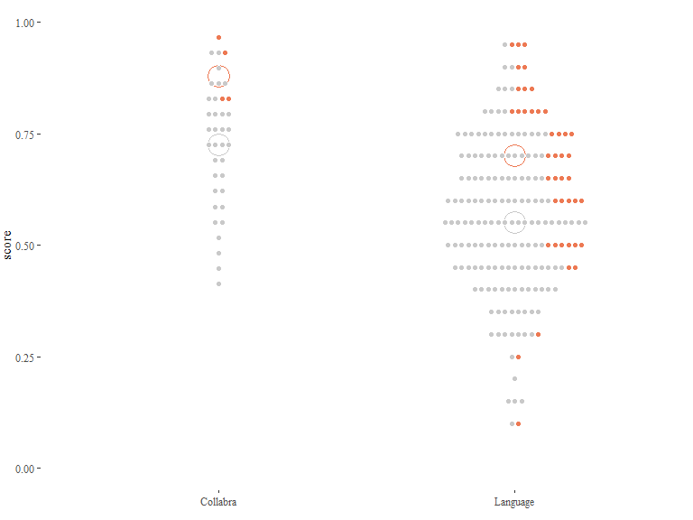
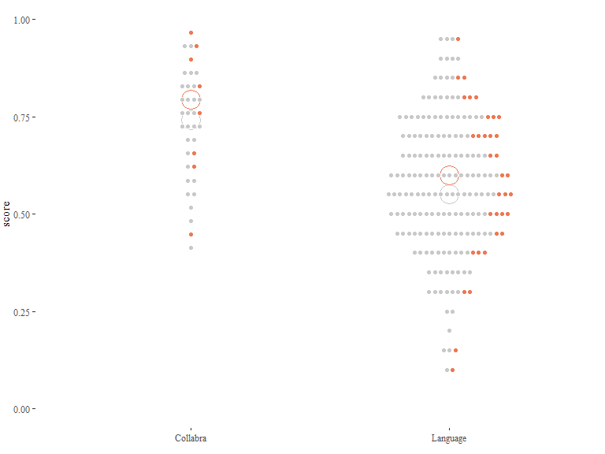
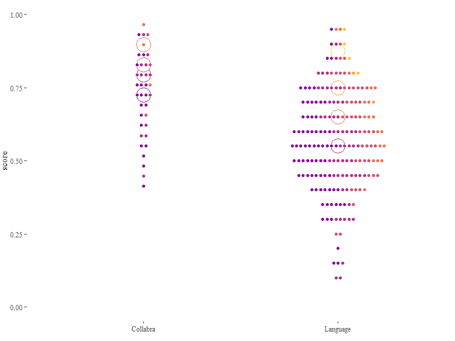

Triangulating iconicity: From structure mapping to guessability
================
Mark Dingemanse & Stella Punselie
Updated 2020-06-17

Code notebook for a study of the relation between linguistically
informed iconicity coding and experimentally collected guessability
scores.

## Setup

``` r
# Packages
list.of.packages <- c("tidyverse","readxl","writexl","ggthemes","viridis","lme4","VGAM")
new.packages <- list.of.packages[!(list.of.packages %in% installed.packages()[,"Package"])]
if(length(new.packages)) install.packages(new.packages)
lapply(list.of.packages, require, character.only=T)

# useful functions
`%notin%` <- function(x,y) !(x %in% y) 
mean.na <- function(x) mean(x, na.rm = T)
sd.na <- function(x) sd(x, na.rm = T)
```

## Data

Let’s load the ground truth version of the coded data.

``` r
d = read_excel("data\\ideophones_coded.xlsx") %>% arrange(filename)

coding_categories <- d %>% dplyr::select(matches('_'),-matches('notes|meaning')) %>% names()
```

We add congruency measures that link F and M elements.

  - TO DO: We need to think about the evidential value of each of the
    congruency measures. Most apply to many words, which is good. If
    some of them only capture a few (as `C_durative` seems to do), they
    are not so interesting because they don’t really capture recurring
    iconic mappings in the data.

<!-- end list -->

``` r
# using ifelse() statements that essentially say, if these conditions are true, use 1, otherwise 0
d <- d %>%
  mutate(C_modality = ifelse(M_sound == 1,1,0),
         C_iterative = ifelse(F_redup == 1 & M_distribution == 1,1,0),
         C_irregular = ifelse(F_redupmod == 1 & M_irregular == 1,1,0),
         C_closure = ifelse(F_closedsyllable == 1 & M_abrupt == 1,1,0),
         C_punctual = ifelse(F_monosyllabic == 1 & M_punctual == 1,1,0),
         C_durative = ifelse(F_finallength == 1 & M_durative == 1,1,0),
         C_weight_voice = ifelse(F_voice== M_weight,1,0 )) %>%
  mutate(C_cumulative = C_modality + C_iterative + C_irregular + C_closure + C_punctual + C_durative + C_weight_voice)

d %>%
  group_by(C_cumulative) %>%
    summarise(n=n(),mean.na(C_cumulative))
```

    ## # A tibble: 5 x 3
    ##   C_cumulative     n `mean.na(C_cumulative)`
    ##          <dbl> <int>                   <dbl>
    ## 1            0    77                       0
    ## 2            1    93                       1
    ## 3            2    43                       2
    ## 4            3    18                       3
    ## 5            4     8                       4

We add guessability scores from the Collabra and Language studies.

``` r
d.scores = read_excel("data\\ideophones_guessability.xlsx") %>%
  dplyr::select(-category)
d <- left_join(d,d.scores,by=c("ideophone","language","study" = "paper"))

# add logodds (it's safer to predict against logodds than raw proportion correct)
d <- d %>%
  group_by(study) %>%
  mutate(logodds = probitlink(score))

# convert some measures to factors for plotting
tofactors <- paste(c("language|category|study|group",names(d[grep('C_',names(d))])),collapse = "|")
d[,grep(tofactors,names(d))] <- lapply(d[,grep(tofactors,names(d))], as.factor)
```

## Plots

A quick first look at some congruency measures.

``` r
ggplot(data=d, aes(x=study,y=score)) +
  theme_tufte() + ylim(0,1) + theme(legend.position="none",axis.title.x=element_blank(),plot.margin=margin(0,0,10,0)) + 
  stat_summary(fun.y=median,geom="point",size=8,shape=21,stroke=1,fill="white",colour="#c9c9c9") +
  geom_dotplot(colour="white",fill="#c9c9c9",stackgroups=T,dotsize=1.5,binwidth=0.01,binaxis="y",stackdir = "center")
```

<!-- -->

``` r
ggsave(filename = "figures//dotplot-all-blank.png",width=5,height = 7.5)

# all data points by language
ggplot(data=d, aes(x=study,y=score,fill=language,colour=language)) +
  theme_tufte() + ylim(0,1) +
  #theme(legend.position="none",axis.title.x=element_blank(),plot.margin=margin(0,0,10,0)) + 
  geom_dotplot(colour="white",alpha=0.8,color=NA,stackgroups=T,dotsize=1.5,binwidth=0.01,binaxis="y",stackdir = "center")
```

<!-- -->

``` r
ggsave(filename = "figures//dotplot-all-bylanguage.png",width=5,height = 7.5)

# Westermann congruency: modality 
ggplot(data=d, aes(x=study,y=score,fill=C_modality,colour=C_modality)) +
  theme_tufte() + ylim(0,1) +
  theme(legend.position="none",axis.title.x=element_blank(),plot.margin=margin(0,0,10,0)) + 
  scale_colour_manual(values=c("#C9C9C9","#ED7953")) +   scale_fill_manual(values=c("#C9C9C9","#ED7953")) +
  stat_summary(fun.y=median,geom="point",size=8,shape=21,stroke=1,fill="white") +
  geom_dotplot(colour="white",stackgroups=T,dotsize=1.5,binwidth=0.01,binaxis="y",stackdir = "center")
```

<!-- -->

``` r
ggsave(filename = "figures//dotplot-C_modality.png",width=5,height = 7.5)

# Westermann congruency: iterativity 
ggplot(data=d, aes(x=study,y=score,fill=C_iterative,colour=C_iterative)) +
  theme_tufte() + ylim(0,1) +
  theme(legend.position="none",axis.title.x=element_blank(),plot.margin=margin(0,0,10,0)) + 
  scale_colour_manual(values=c("#C9C9C9","#ED7953")) +   scale_fill_manual(values=c("#C9C9C9","#ED7953")) +
  stat_summary(fun.y=median,geom="point",size=8,shape=21,stroke=1,fill="white") +
  geom_dotplot(colour="white",stackgroups=T,dotsize=1.5,binwidth=0.01,binaxis="y",stackdir = "center")
```

<!-- -->

``` r
ggsave(filename = "figures//dotplot-C_iterative.png",width=5,height = 7.5)

# Westermann congruency: irregular 
ggplot(data=d, aes(x=study,y=score,fill=C_irregular,colour=C_irregular)) +
  theme_tufte() + ylim(0,1) +
  theme(legend.position="none",axis.title.x=element_blank(),plot.margin=margin(0,0,10,0)) + 
  scale_colour_manual(values=c("#C9C9C9","#ED7953")) +   scale_fill_manual(values=c("#C9C9C9","#ED7953")) +
  stat_summary(fun.y=median,geom="point",size=8,shape=21,stroke=1,fill="white") +
  geom_dotplot(colour="white",stackgroups=T,dotsize=1.5,binwidth=0.01,binaxis="y",stackdir = "center")
```

<!-- -->

``` r
ggsave(filename = "figures//dotplot-C_irregular.png",width=5,height = 7.5)

# Westermann congruency: punctual 
ggplot(data=d, aes(x=study,y=score,fill=C_punctual,colour=C_punctual)) +
  theme_tufte() + ylim(0,1) +
  theme(legend.position="none",axis.title.x=element_blank(),plot.margin=margin(0,0,10,0)) + 
  scale_colour_manual(values=c("#C9C9C9","#ED7953")) +   scale_fill_manual(values=c("#C9C9C9","#ED7953")) +
  stat_summary(fun.y=median,geom="point",size=8,shape=21,stroke=1,fill="white") +
  geom_dotplot(colour="white",stackgroups=T,dotsize=1.5,binwidth=0.01,binaxis="y",stackdir = "center")
```

<!-- -->

``` r
ggsave(filename = "figures//dotplot-C_punctual.png",width=5,height = 7.5)

# Westermann congruency: durative 
ggplot(data=d, aes(x=study,y=score,fill=C_durative,colour=C_durative)) +
  theme_tufte() + ylim(0,1) +
  theme(legend.position="none",axis.title.x=element_blank(),plot.margin=margin(0,0,10,0)) + 
  scale_colour_manual(values=c("#C9C9C9","#ED7953")) +   scale_fill_manual(values=c("#C9C9C9","#ED7953")) +
  stat_summary(fun.y=median,geom="point",size=8,shape=21,stroke=1,fill="white") +
  geom_dotplot(colour="white",stackgroups=T,dotsize=1.5,binwidth=0.01,binaxis="y",stackdir = "center")
```

<!-- -->

``` r
ggsave(filename = "figures//dotplot-C_durative.png",width=5,height = 7.5)

# Westermann congruency: weight_voice 
ggplot(data=d, aes(x=study,y=score,fill=C_weight_voice,colour=C_weight_voice)) +
  theme_tufte() + ylim(0,1) +
  theme(legend.position="none",axis.title.x=element_blank(),plot.margin=margin(0,0,10,0)) + 
  scale_colour_manual(values=c("#C9C9C9","#ED7953")) +   scale_fill_manual(values=c("#C9C9C9","#ED7953")) +
  stat_summary(fun.y=median,geom="point",size=8,shape=21,stroke=1,fill="white") +
  geom_dotplot(colour="white",stackgroups=T,dotsize=1.5,binwidth=0.01,binaxis="y",stackdir = "center")
```

<!-- -->

``` r
ggsave(filename = "figures//dotplot-C_weight_voice.png",width=5,height = 7.5)

# Westermann congruency: cumulative
ggplot(data=d, aes(x=study,y=score,colour=C_cumulative,fill=C_cumulative)) +
  theme_tufte() + ylim(0,1) +
  theme(legend.position="none",axis.title.x=element_blank(),plot.margin=margin(0,0,10,0)) + 
  scale_fill_viridis(option="plasma",discrete=T,begin=0.3,end=0.9) +
  scale_colour_viridis(option="plasma",discrete=T,begin=0.3,end=0.9) +
  stat_summary(fun.y=median,geom="point",size=8,shape=21,stroke=1,fill="white") +
  geom_dotplot(colour="white",stackgroups = T,dotsize=1.5,binwidth=0.01,binaxis="y",stackdir = "center")
```

<!-- -->

``` r
ggsave(filename = "figures//dotplot-C_cumulative.png",width=5,height = 7.5)
```

Probably useful to build a plotting function to avoid redundancies. To
do: \* use `aes_string()` or similar \* add options to plot log odds,
facet by semantic domain, language, or study, etc.

``` r
# icoplot() to make creating congruency plots easier
# to do: fix substitution error
# * build in variables for score vs log odds, faceting by study or semantic domain, etc.
icoplot <- function(var=NULL,saveplot=FALSE) {
  
  print(paste("Plotting",var))
  var <- substitute(var)

  # build plot
  p <- ggplot(data=d,aes(x=study,y=score,fill="var",colour="var")) +
    theme_tufte() + ylim(0,1) +
    theme(legend.position="none",axis.title.x=element_blank(),plot.margin=margin(0,0,10,0)) + 
    scale_colour_manual(values=c("#C9C9C9","#ED7953")) +   scale_fill_manual(values=c("#C9C9C9","#ED7953")) +
    stat_summary(fun.y=median,geom="point",size=8,shape=21,stroke=1,fill="white") +
    geom_dotplot(colour="white",stackgroups=T,dotsize=1.5,binwidth=0.01,binaxis="y",stackdir = "center")

  # save plot
  if (saveplot) {
    filename <- paste0("dotplot-",var,".png")
    print(paste("Saving as",filename))
    ggsave(file=paste0("figures//",filename,width=5,height=7.5))
  }

    # plot plot
  suppressWarnings(print(p))
  
}
#icoplot(var="C_cumulative")
```
