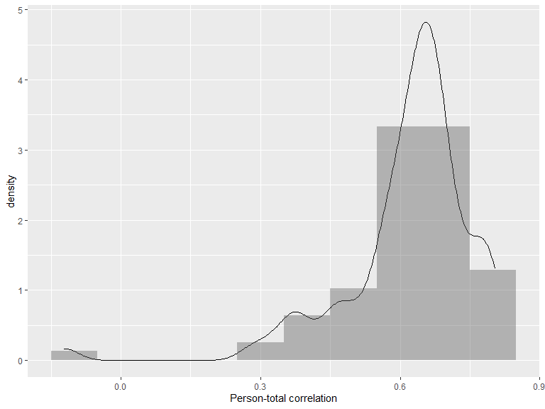
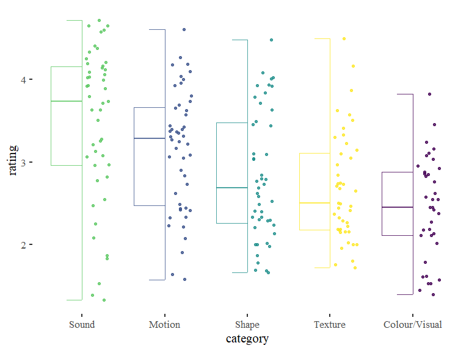
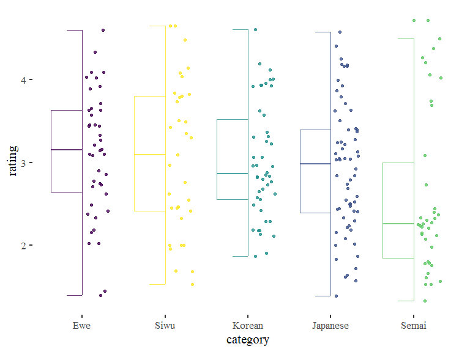
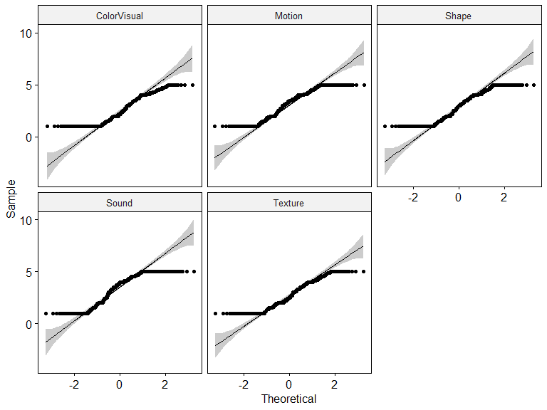

Triangulating iconicity: Iconicity ratings
================
Mark Dingemanse & Stella Punselie
Updated 2022-01-17

Code notebook for a study of the relation between iconicity ratings and
experimentally collected guessability scores.

## Setup

``` r
# Packages
library(tidyverse)
library(readxl)
library(plyr)
library(ggthemes)
library(gghalves)
library(car)
library(emmeans)
library(plotly)
library(ggpubr)
library(viridis)

# useful functions
`%notin%` <- function(x,y) !(x %in% y) 
mean.na <- function(x) mean(x, na.rm = T)
sd.na <- function(x) sd(x, na.rm = T)
```

## Rating: descriptives

``` r
# load dataframe with all ratings
read.csv("data\\ideophones_rated_uncorr.csv",header=TRUE,na.strings=c("", "NA"),sep=";",check.names=FALSE) -> d.uncorr

# to long format
d.uncorr <- gather(d.uncorr, item, rating, 6:245)
d.uncorr <- d.uncorr[,c(1,6,7)]
colnames(d.uncorr) <- c("rater","item","rating")
#remove empty cells
d.uncorr <- subset(d.uncorr, !is.na(d.uncorr[,"rating"]))
#change ratings to numeric values with decimals
as.numeric(sub(",", ".", d.uncorr$rating, fixed = TRUE)) -> d.uncorr$rating


# check for inconsistent raters with person-total correlation based on Motamedi et al. (2019)

ptc <- d.uncorr[,c("item","rater","rating")]
personTotalCorrelationCorrected <- function(ptc)
  {
  require(tidyverse)
  ptc %>%
    dplyr::rename(raterFocal = rater,
           ratingFocal = rating) %>%
    full_join(ptc, by='item') %>%
    filter(rater!=raterFocal) %>%
    group_by(item, raterFocal, ratingFocal) %>%
    summarise(ratingsOthers = mean(rating, na.rm=TRUE)) %>%
    base::split(.$raterFocal) %>%
    map(~cor(.$ratingFocal, .$ratingsOthers, 
             use="pairwise.complete.obs")) %>%
    as.data.frame %>%
    gather %>%
    dplyr::rename(rater = key, perTotCor = value)
}
View(personTotalCorrelationCorrected(ptc))

#plot person-total correlations
ptc %>%
select(item, rater, rating) %>%
personTotalCorrelationCorrected %>%
ggplot(aes(x=perTotCor)) + 
  geom_density() + 
  geom_histogram(stat="bin", 
                 alpha=0.4,
                 aes(y=..density..),
                 binwidth=0.1) +
  labs(x="Person-total correlation")
```

<!-- -->

``` r
ggsave("figures\\rating_PerTotCorr.png",height=5,width=7.5)
```

One participant (N045) showed a negative person-total correlation, which
according to Curran (2016) indicates a careless responder rendering
invalid data. Inspection of this participant’s data showed they had
indeed given the same answer to every question. I therefore decided to
remove this participant from the dataset.

Two other participatns (N022 and N034) also had to be removed because of
their knowledge of Japanese and Korean, resulting in a total of 75
participants to be included in the analysis.

``` r
# load corrected data
d <- read_xlsx("data\\ideophones_rated.xlsx")
d.means <- read_xlsx("data\\ideophones_rated_means.xlsx")

# get means and standard deviations across all ideophones and for each language and category
mean(d$rating)
```

    ## [1] 2.948339

``` r
  # 2.948339
sd(d$rating)
```

    ## [1] 1.297106

``` r
  # 1.297106
sumcat <- ddply(d,~category,summarise,mean=mean(rating),sd=sd(rating))
sumlang <- ddply(d,~language,summarise,mean=mean(rating),sd=sd(rating))
```

Because the category “Other” is quite a vague residual category with
only 17 items (as opposed to 30-40 items for the other categories), I
decided to remove this category for now. I will keep a copy that
includes the ratings for “Other”.

``` r
#create copy of data including the category "Other"
d.other <- read_xlsx("data\\ideophones_rated.xlsx")
d.m.other <- read_xlsx("data\\ideophones_rated_means.xlsx")

#remove category "Other" from d and d.means
d <- d[!grepl("Other",d$category),]
d.means <- d.means[!grepl("Other",d.means$category),]

# make new summary for language (without the Japanese "other" ideophones)
sumlang2 <- ddply(d,~language,summarise,mean=mean(rating),sd=sd(rating))
```

Here we plot the distribution of the rating data.

``` r
#convert some columns to factors
cols <- c("category","language","study")
d[cols] <- lapply(d[cols], factor)
d.means[cols] <- lapply(d.means[cols], factor)

#combined boxplot and scatterplot by category
ggplot(d.means, aes(x=reorder(category,-rating),y=rating,color=category)) +
  theme_tufte(base_size=16) +
  geom_half_boxplot(aes(middle=mean(rating)),show.legend=F) +
  geom_half_point(show.legend=F) +
  scale_colour_viridis_d(option="D",alpha=0.8) +
  xlab("category") + scale_x_discrete(labels = c("Sound","Motion","Shape", 
  "Texture","Colour/Visual"))
```

<!-- -->

``` r
ggsave("figures\\rating_category.png",height=5,width=7.5)

#same, but by language
ggplot(d.means, aes(x=reorder(language,-rating),y=rating,color=language)) +
  theme_tufte(base_size=16) +
  geom_half_boxplot(aes(middle=mean(rating)),show.legend=F) +
  geom_half_point(show.legend=F) +
  scale_colour_viridis_d(option="D",alpha=0.8) +
  xlab("category")
```

<!-- -->

``` r
ggsave("figures\\rating_language.png",height=5,width=7.5)
```

## Statistics

Now we want to see which categories and languages differ significantly
from the others in their iconicity ratings.

First, we check the assumptions.

``` r
# check normality by visual inspection
ggqqplot(d, "rating", facet.by = "category")
```

<!-- -->

``` r
  # all points fall approximately along the reference line, so normality can be assumed

# check homogeneity of variance with Levene's test
leveneTest(rating~category,data=d)
```

    ## Levene's Test for Homogeneity of Variance (center = median)
    ##         Df F value Pr(>F)  
    ## group    4  2.1282 0.0747 .
    ##       4253                 
    ## ---
    ## Signif. codes:  0 '***' 0.001 '**' 0.01 '*' 0.05 '.' 0.1 ' ' 1

``` r
leveneTest(rating~language,data=d)
```

    ## Levene's Test for Homogeneity of Variance (center = median)
    ##         Df F value Pr(>F)
    ## group    4  1.7302 0.1403
    ##       4253

``` r
  # both are not significant (> .05), so homogeneity of variance can be assumed
```

Now we construct a linear model with category as a predictor of the
iconicity ratings.

``` r
summary(lm.cat <- lm(rating ~ category, d))
```

    ## 
    ## Call:
    ## lm(formula = rating ~ category, data = d)
    ## 
    ## Residuals:
    ##     Min      1Q  Median      3Q     Max 
    ## -2.4728 -1.0819  0.1267  1.0272  2.5476 
    ## 
    ## Coefficients:
    ##                 Estimate Std. Error t value Pr(>|t|)    
    ## (Intercept)      2.45239    0.04706  52.109  < 2e-16 ***
    ## categoryMotion   0.72489    0.06264  11.572  < 2e-16 ***
    ## categoryShape    0.42095    0.06260   6.725 1.99e-11 ***
    ## categorySound    1.02045    0.06326  16.131  < 2e-16 ***
    ## categoryTexture  0.22955    0.06420   3.576 0.000353 ***
    ## ---
    ## Signif. codes:  0 '***' 0.001 '**' 0.01 '*' 0.05 '.' 0.1 ' ' 1
    ## 
    ## Residual standard error: 1.254 on 4253 degrees of freedom
    ## Multiple R-squared:  0.07323,    Adjusted R-squared:  0.07236 
    ## F-statistic: 84.01 on 4 and 4253 DF,  p-value: < 2.2e-16

``` r
# pairwise comparisons with Tukey adjustments in the emmeans package
emm.cat <- emmeans(lm.cat, "category")
pairs(emm.cat)
```

    ##  contrast              estimate     SE   df t.ratio p.value
    ##  ColorVisual - Motion    -0.725 0.0626 4253 -11.572  <.0001
    ##  ColorVisual - Shape     -0.421 0.0626 4253  -6.725  <.0001
    ##  ColorVisual - Sound     -1.020 0.0633 4253 -16.131  <.0001
    ##  ColorVisual - Texture   -0.230 0.0642 4253  -3.576  0.0032
    ##  Motion - Shape           0.304 0.0584 4253   5.202  <.0001
    ##  Motion - Sound          -0.296 0.0591 4253  -4.998  <.0001
    ##  Motion - Texture         0.495 0.0601 4253   8.238  <.0001
    ##  Shape - Sound           -0.599 0.0591 4253 -10.147  <.0001
    ##  Shape - Texture          0.191 0.0601 4253   3.186  0.0126
    ##  Sound - Texture          0.791 0.0608 4253  13.014  <.0001
    ## 
    ## P value adjustment: tukey method for comparing a family of 5 estimates

``` r
pwpm(emm.cat)
```

    ##             ColorVisual Motion  Shape  Sound Texture
    ## ColorVisual      [2.45] <.0001 <.0001 <.0001  0.0032
    ## Motion           -0.725 [3.18] <.0001 <.0001  <.0001
    ## Shape            -0.421  0.304 [2.87] <.0001  0.0126
    ## Sound            -1.020 -0.296 -0.599 [3.47]  <.0001
    ## Texture          -0.230  0.495  0.191  0.791  [2.68]
    ## 
    ## Row and column labels: category
    ## Upper triangle: P values   adjust = "tukey"
    ## Diagonal: [Estimates] (emmean) 
    ## Lower triangle: Comparisons (estimate)   earlier vs. later

And here we do the same with language as predictor.

``` r
summary(lm.lang <- lm(rating ~ language, d))
```

    ## 
    ## Call:
    ## lm(formula = rating ~ language, data = d)
    ## 
    ## Residuals:
    ##      Min       1Q   Median       3Q      Max 
    ## -2.13631 -1.10673  0.07485  1.07451  2.42020 
    ## 
    ## Coefficients:
    ##                  Estimate Std. Error t value Pr(>|t|)    
    ## (Intercept)       3.10673    0.04596  67.597  < 2e-16 ***
    ## languageJapanese -0.18159    0.05913  -3.071  0.00215 ** 
    ## languageKorean   -0.08124    0.06355  -1.278  0.20118    
    ## languageSemai    -0.52693    0.06666  -7.905  3.4e-15 ***
    ## languageSiwu      0.02958    0.06714   0.441  0.65957    
    ## ---
    ## Signif. codes:  0 '***' 0.001 '**' 0.01 '*' 0.05 '.' 0.1 ' ' 1
    ## 
    ## Residual standard error: 1.289 on 4253 degrees of freedom
    ## Multiple R-squared:  0.02032,    Adjusted R-squared:  0.0194 
    ## F-statistic: 22.06 on 4 and 4253 DF,  p-value: < 2.2e-16

``` r
# pairwise comparisons in emmeans package
emm.lang <- emmeans(lm.lang, "language")
pairs(emm.lang)
```

    ##  contrast          estimate     SE   df t.ratio p.value
    ##  Ewe - Japanese      0.1816 0.0591 4253   3.071  0.0183
    ##  Ewe - Korean        0.0812 0.0635 4253   1.278  0.7046
    ##  Ewe - Semai         0.5269 0.0667 4253   7.905  <.0001
    ##  Ewe - Siwu         -0.0296 0.0671 4253  -0.441  0.9922
    ##  Japanese - Korean  -0.1003 0.0575 4253  -1.744  0.4069
    ##  Japanese - Semai    0.3453 0.0610 4253   5.665  <.0001
    ##  Japanese - Siwu    -0.2112 0.0615 4253  -3.435  0.0054
    ##  Korean - Semai      0.4457 0.0653 4253   6.830  <.0001
    ##  Korean - Siwu      -0.1108 0.0657 4253  -1.686  0.4429
    ##  Semai - Siwu       -0.5565 0.0688 4253  -8.094  <.0001
    ## 
    ## P value adjustment: tukey method for comparing a family of 5 estimates

``` r
pwpm(emm.lang)
```

    ##              Ewe Japanese  Korean   Semai   Siwu
    ## Ewe       [3.11]   0.0183  0.7046  <.0001 0.9922
    ## Japanese  0.1816   [2.93]  0.4069  <.0001 0.0054
    ## Korean    0.0812  -0.1003  [3.03]  <.0001 0.4429
    ## Semai     0.5269   0.3453  0.4457  [2.58] <.0001
    ## Siwu     -0.0296  -0.2112 -0.1108 -0.5565 [3.14]
    ## 
    ## Row and column labels: language
    ## Upper triangle: P values   adjust = "tukey"
    ## Diagonal: [Estimates] (emmean) 
    ## Lower triangle: Comparisons (estimate)   earlier vs. later

## Combined data

Here we load the combined coding and guessability data and then add the
rating data.

``` r
# get coded and guessed data from previous step (TI_02_congruence)
d = read.csv("data\\ideophones_coded_guessed.csv")

coding_categories <- d %>% dplyr::select(matches('F_|M_'),-matches('notes|meaning')) %>% names()

# add mean ratings
d.ratings = read_excel("data\\ideophones_rated_means.xlsx") %>%
  dplyr::select(-c(item,category,list))
d <- left_join(d,d.ratings,by=c("filename","language","study"))

# convert ratings to z-scores for comparison with guessability (logodd) scores
d$rating_z <- scale(d$rating,center=T,scale=T)

#remove category "Other"
d <- d[!grepl("Other",d$category),]
```

## Visualisations

Let’s first visualise the relation between the rating and guessing data.

``` r
ggplot(d,aes(x=rating_z,y=score_z)) +   
  geom_point(aes(colour=study),position="jitter") +
  geom_smooth(method=lm,colour="black") +
  theme_tufte(base_size = 16) +
  xlab("rating") + ylab("guessability")
```

<!-- -->

``` r
#ggsave("figures\\rating_guessing_corr.png",height=5,width=7.5)

ggplot(d,aes(x=rating_z,y=score_z)) +   
  geom_point(aes(colour=category,shape=study),position="jitter") +
  geom_smooth(method=loess,colour="black") +
  theme_tufte(base_size = 16) +
  xlab("rating") + ylab("guessability")
```

<!-- -->

There appears to be a positive correlation between the rating and
guessing data.

Now let’s visualise the relations between the coding, guessing and
rating data.

``` r
ggplot(d,aes(x=rating_z,y=logodds, color=C_cumulative)) +
  geom_point() +
  geom_smooth(method=loess) +
  scale_fill_viridis(option="plasma",discrete=F,begin=0.3,end=0.9) +
  scale_colour_viridis(option="plasma",discrete=F,begin=0.3,end=0.9) +
  NULL
```

<!-- -->

``` r
#plot_ly(data=d,x=rating_z,y=score_z,color=C_simple)
```

## Statistics

``` r
# Pearson correlation
cor.test(d$score_z,d$rating_z,method="pearson")
```

    ## 
    ##  Pearson's product-moment correlation
    ## 
    ## data:  d$score_z and d$rating_z
    ## t = 11.564, df = 220, p-value < 2.2e-16
    ## alternative hypothesis: true correlation is not equal to 0
    ## 95 percent confidence interval:
    ##  0.5257348 0.6906077
    ## sample estimates:
    ##       cor 
    ## 0.6148452

``` r
cor.rank <- cor.test(d$score_z,d$C_cumulative,method="spearman")
```

Pearson’s correlation coefficient indicates that there is indeed a
strong positive correlation between the guessing and rating data, r(220)
= .61, p \< .001.

``` r
#check where the guessing and rating data deviate
d %>%
  filter(rating_z-score_z > 2 | rating_z-score_z < -2)%>%
  dplyr::select(filename,ideophone,rating,rating_z,language,logodds,score,score_z) %>%
  arrange(score) %>% ungroup()
```

    ##                  filename       ideophone   rating   rating_z language
    ## 1   Korean_11_Texture_org  kkokkulkkokkul 2.733333 -0.2451933   Korean
    ## 2    Semai_20_Texture_org     grigelrigel 4.494444  1.9094377    Semai
    ## 3 Semai_6_ColorVisual_org sl<U+0294>e~e~k 1.572222 -1.6657545    Semai
    ## 4 Semai_2_ColorVisual_org bl<U+0294>oo::k 1.611111 -1.6181759    Semai
    ##      logodds score    score_z
    ## 1 -1.0364334  0.15 -2.4226880
    ## 2  0.1256613  0.55 -0.1445112
    ## 3  0.5244005  0.70  0.7098051
    ## 4  0.8416212  0.80  1.2793493
