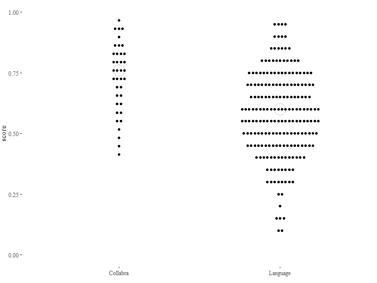

Triangulating iconicity: Coding analysis
================
[anonymised for review] Updated 2024-04-03

Code notebook for a study of the relation between linguistically
informed iconicity coding and experimentally collected guessability
scores.

## Setup

``` r
# Packages
list.of.packages <- c("tidyverse","readxl","writexl","ggthemes","gghalves","ggbeeswarm","viridis","lme4","VGAM","cowplot")
new.packages <- list.of.packages[!(list.of.packages %in% installed.packages()[,"Package"])]
if(length(new.packages)) install.packages(new.packages)
lapply(list.of.packages, require, character.only=T)

# useful functions
`%notin%` <- function(x,y) !(x %in% y) 
mean.na <- function(x) mean(x, na.rm = T)
sd.na <- function(x) sd(x, na.rm = T)
```

## Data

Here we load the ground truth version of the coded data and add the
independently collected guessability scores from the 2016 Collabra and
Language papers.

``` r
# get consensus coding data
d = read_excel("data/ideophones_coded.xlsx") |> arrange(filename)

# add guessability scores from the Collabra and Language studies.

d.scores = read_excel("data/ideophones_guessability.xlsx") |>
  dplyr::select(-category)
d <- left_join(d,d.scores,by=c("ideophone","language","study" = "paper"))

# add logodds (for when we run stats: it's more sensible to predict against logodds than raw proportion correct)
d <- d |>
  group_by(study) |>
  mutate(logodds = probitlink(score))

# add Z score to make scores more comparable in plots across studies
d <- d |>
  group_by(study) |>
  mutate(score_z = scale(score,center=T,scale=T))

# get ratings data
d.ratings <- read_xlsx("data/ideophones_rated_means.xlsx") |>
  dplyr::select(-category,-list,-item)
d <- left_join(d,d.ratings,by=c("filename","study","language")) |>
  mutate(filename = gsub("_org","",filename))

# add z score for ratings
d$rating_z <- scale(d$rating,center=T,scale=T)

# write this dataset as the fullest dataset
write.csv(d,file="data/ideophones_coded_guessed_rated.csv",fileEncoding = "UTF-8")
write_xlsx(d,path="data/ideophones_coded_guessed_rated.xlsx")

# load and merge the full ratings data for some of the reporting in the paper
ideophones_filename <- d |> ungroup() |> select(ideophone,filename) |>
  mutate(filename = str_to_lower(filename))

d.ratings.full <- read_xlsx("data/ideophones_rated.xlsx") |>
  mutate(list = gsub(".*([A-Z])$", "\\1",item)) |>
  mutate(filename = gsub("^(.*)_.*$", "\\1", str_to_lower(item))) |>
  mutate(filename = gsub("Coll_","", filename)) |>
  select(-item) 

# match the data to ideophones for easier lookup
d.ratings.full <- left_join(d.ratings.full,
                  ideophones_filename,by="filename",copy=TRUE)
```

## Figures

Here we generate some descriptive stats and create the main figures for
the paper. Note that Figures 1 and 2 in the paper are illustrative and
their final versions are not generated in R.

``` r
d |>
  group_by(study) |>
  dplyr::summarize(max=max(score),min=min(score),mean=mean.na(score))
```

    ## # A tibble: 2 × 4
    ##   study      max   min  mean
    ##   <chr>    <dbl> <dbl> <dbl>
    ## 1 Collabra 0.966 0.414 0.730
    ## 2 Language 0.95  0.1   0.575

### Figure 2: Overview panel

The overview of the triangulation method is created separately in
CorelDraw but we use the data from the guessability studies as a canvas.

``` r
# make a copy dp of the data in which we convert some measures to factors for easy plotting & faceting
tofactors <- paste(c("language|category|study|group",names(d[grep('C_',names(d))])),collapse = "|")
dp <- d
dp[,grep(tofactors,names(dp))] <- lapply(dp[,grep(tofactors,names(dp))], as.factor)

# blank plot can be useful as a canvas 
ggplot(data=dp, aes(x=study,y=score)) +
  theme_tufte() + ylim(0,1) + theme(legend.position="none",axis.title.x=element_blank(),plot.margin=margin(0,0,10,0)) + 
  stat_summary(fun=median,geom="point",size=8,shape=21,stroke=1,fill="white",colour="#c9c9c9") +
  geom_dotplot(colour="white",fill="black",stackgroups=T,dotsize=1.5,binwidth=0.01,binaxis="y",stackdir = "center")
```

<!-- -->

``` r
ggsave("figures/fig2-guessability-blank.pdf",height=5,width=7.5)
```

### Figure 3: Guessability and cumulative iconicity

``` r
# panel A: scores by study and cumulative iconicity
pA <- ggplot(data=dp, aes(x=study,y=score,fill=C_cumulative,colour=C_cumulative)) +
  theme_tufte() + ylim(0,1) + theme(legend.position="none") + 
  labs(title="Guessability by study",
       x="study",
       y="guessability (% correct)") +
  scale_fill_viridis(option="plasma",discrete=T,begin=0.3,end=0.9) +
  scale_colour_viridis(option="plasma",discrete=T,begin=0.3,end=0.9) +
  stat_summary(fun.y=median,geom="point",size=8,shape=21,stroke=1,fill="white") +
  geom_dotplot(stackgroups=T,dotsize=1.5,binwidth=0.01,binaxis="y",stackdir = "center") +
  NULL

pB <- ggplot(data=dp, aes(x=C_cumulative,y=score_z,colour=C_cumulative)) +
  theme_tufte() + theme(legend.position="none") +
  labs(title="Guessability (both studies) by cumulative iconicity",
       x="cumulative iconicity",
       y=expression('guessability ('~italic(z)~')')) +
  geom_half_boxplot() +
  geom_half_point() +
  scale_fill_viridis(option="plasma",discrete=T,begin=0.3,end=0.9) +
  scale_colour_viridis(option="plasma",discrete=T,begin=0.3,end=0.9) +
  NULL

plot_grid(pA,pB,labels=c("A","B"),label_size=14,rel_widths = c(1.4,2))
```

<!-- -->

``` r
ggsave("figures/fig3-panelAB.png",height=4,width=9,bg="white")
```

### Figure 4: Ratings by study (A) and by semantic domain (B)

Panel figure for Study B providing a view of ratings per study and per
semantic domain.

``` r
#panel A: ratings by study
pA <- d |>  ggplot(aes(x=score_z,y=rating)) +   
  theme_tufte(base_size = 16) +
  theme(legend.position = c(0.2,0.9),
        legend.title = element_blank()) +
  scale_fill_manual(values=c("white","black")) +
  geom_point(aes(fill=study),
             position="jitter",
             shape=21,
             colour="black") +
  geom_smooth(method=loess,colour="black",alpha=0.5) +
  xlab("guessability (z)") + ylab("rating") +
  NULL

#panel B: ratings by semantic domain
pB <- d |>
  filter(category != "Other") |>
  ggplot(aes(x=reorder(category,-rating),y=rating,color=category)) +
  theme_tufte(base_size=16) +
  geom_half_boxplot(aes(middle=mean(rating)),show.legend=F) +
  geom_half_point(show.legend=F) +
  scale_colour_viridis_d(option="D",alpha=0.8) +
  xlab("category") + scale_x_discrete(labels = c("Sound","Motion","Shape", 
  "Texture","Colour/Visual"))

plot_grid(pA,pB,labels=c("A","B"),label_size=14,rel_widths = c(1.6,2))
```

<!-- -->

``` r
ggsave("figures/fig4-panel_ratings.png",height=4,width=9,bg="white")


# a correlation test shows a Pearson correlation of .57 between iconicity rating
# and guessability
cor.test(d$rating_z,d$logodds,method="pearson")
```

    ## 
    ##  Pearson's product-moment correlation
    ## 
    ## data:  d$rating_z and d$logodds
    ## t = 10.56, df = 237, p-value < 2.2e-16
    ## alternative hypothesis: true correlation is not equal to 0
    ## 95 percent confidence interval:
    ##  0.4726878 0.6461679
    ## sample estimates:
    ##       cor 
    ## 0.5656539

Table 3: Examples of ideophones from the low/high rating/guessability
quadrants

``` r
# these examples are given in Table 3 in the paper
examples <- c("ton ton","kpa",
              "slʔẽẽk","miɔmiɔ",
              "kodzokodzo","ɟtoonɟtoonɟtoon",
              "fututu", "plɒ̃s")
d |>
  filter(ideophone %in% examples) |>
  group_by(ideophone,language) |>
  dplyr::summarise(n=n(),
                   mean_rating = mean(rating),
                   score = score)
```

    ## # A tibble: 9 × 5
    ## # Groups:   ideophone [8]
    ##   ideophone       language     n mean_rating score
    ##   <chr>           <chr>    <int>       <dbl> <dbl>
    ## 1 fututu          Siwu         1        1.53  0.1 
    ## 2 kodzokodzo      Ewe          1        3.44  0.45
    ## 3 kpa             Ewe          1        4.09  0.7 
    ## 4 kpa             Siwu         1        4.65  0.85
    ## 5 miɔmiɔ          Siwu         1        2     0.7 
    ## 6 plɒ̃s            Semai        1        1.33  0.1 
    ## 7 slʔẽẽk          Semai        1        1.57  0.7 
    ## 8 ton ton         Japanese     1        4.41  0.95
    ## 9 ɟtoonɟtoonɟtoon Semai        1        3.74  0.45

### Figure 5: Ratings and cumulative iconicity

``` r
# panel A: ratings by study and cumulative iconicity
pA <- ggplot(data=dp, aes(x="",y=rating,fill=C_cumulative,colour=C_cumulative)) +
  theme_tufte() +  ylim(1,5) + theme(legend.position="none") + 
  labs(title="Iconicity ratings for 239 ideophones",
       x="all ideophones",
       y="mean iconicity rating") +
  scale_fill_viridis(option="plasma",discrete=T,begin=0.3,end=0.9) +
  scale_colour_viridis(option="plasma",discrete=T,begin=0.3,end=0.9) +
  geom_beeswarm(cex=2.5) +
  NULL

pB <- ggplot(data=dp, aes(x=C_cumulative,y=rating,colour=C_cumulative)) +
  theme_tufte() +  ylim(1,5) + theme(legend.position="none") +
  labs(title="... by independently coded structural correspondences",
       x="cumulative iconicity",
       y="mean iconicity rating") +
  geom_half_boxplot() +
  geom_half_point() +
  scale_fill_viridis(option="plasma",discrete=T,begin=0.3,end=0.9) +
  scale_colour_viridis(option="plasma",discrete=T,begin=0.3,end=0.9) +
  NULL

plot_grid(pA,pB,labels=c("A","B"),label_size=14,rel_widths = c(1.4,2))
```

<!-- -->

``` r
ggsave("figures/fig6-panelAB_ratings.png",height=5,width=9,bg="white")
```

## Numbers

### Coding and guessability

As the visualizations already make clear there is a non-trivial positive
relation between the presence of iconic mappings (in a cumulative sense)
and the guessability score determined in experimental work.

The simplest thing to do is a correlation.

``` r
# Pearson correlation for both of the studies
d.Collabra <- d |> filter(study == "Collabra")
d.Language <- d |> filter(study == "Language")
correlation.Collabra <- cor.test(d.Collabra$logodds,d.Collabra$C_cumulative,method="pearson")
correlation.Language <- cor.test(d.Language$logodds,d.Language$C_cumulative,method="pearson")

# Bonferroni-correcting the p values for multiple comparisons
p1 <- correlation.Collabra$p.value
p2 <- correlation.Language$p.value
pvalues <-p.adjust(c(p1,p2),method="bonferroni")  
```

The correlation is found in the Collabra study (Pearson’s r = 0.46, p =
0.0079189) as well as in the Language study (Pearson’s r = 0.35, p
4.6611441^{-7}, p-values Bonferroni-corrected for multiple comparisons).

But it’s probably more useful to predict logodds score on the basis of
what we know about paper (= a proxy for method) and the main measures of
form-meaning congruence. For this we can use logistic regression.

A null model `m0` predices logodds by paper, controlling for item-level
differences. A model `m1` with cumulative congruence as an additional
fixed effect fares significantly better.

For the fixed effects, m1 lists a 0.182 improvement in logodds for
C_cumulative. According to my interpretation this means that every added
iconic feature leads to a ~7% boost in proportion correct.

Also note that, accounting for possible difference in coded cumulative
iconicity across studies, the Language paper has a negative fixed effect
of -0.524, which translates to a 19% guessability penalty for the
relatively unforgiving method of the Language study (or alternatively, a
similar-sized boost for the methods of the Collabra study).

``` r
m0 <- lmer(logodds ~ study + (1|ideophone), data=d)
m1 <- lmer(logodds ~ study + C_cumulative + (1|ideophone), data=d)
anova(m0,m1)
```

    ## Data: d
    ## Models:
    ## m0: logodds ~ study + (1 | ideophone)
    ## m1: logodds ~ study + C_cumulative + (1 | ideophone)
    ##    npar    AIC    BIC  logLik deviance Chisq Df Pr(>Chisq)    
    ## m0    4 352.46 366.36 -172.23   344.46                        
    ## m1    5 324.16 341.54 -157.08   314.16  30.3  1  3.701e-08 ***
    ## ---
    ## Signif. codes:  0 '***' 0.001 '**' 0.01 '*' 0.05 '.' 0.1 ' ' 1

``` r
# fixed effects
fixef(m1)
```

    ##   (Intercept) studyLanguage  C_cumulative 
    ##     0.5485263    -0.5232782     0.1579272

``` r
# turn this into a percentage under the simplifying assumption that the distance
# between iconicity measures is the same at every scale point
probitlink(fixef(m1)[[3]],inverse=T)-0.5
```

    ## [1] 0.06274293

``` r
probitlink(fixef(m1)[[2]],inverse=T)-0.5
```

    ## [1] -0.1996097

We can assess the relative weight of different features using model
comparison. We build models by adding the congruency measures in rank
order of attestation in the coded data. Doing this we find that
C_aspect, C_modality and C_length are responsible for the bulk of the
variance. Compared to the null model that only represents the baseline
difference between studies, model `m8` fares significantly better (log
likelihood difference = 21.3).

The model estimates given in the output of `fixef(m8)` represent the
contribution of a given fixed effect while controlling for others, but
they are NOT additive (i.e. can’t be summed to arrive at the effect of
`C_cumulative`).

- `C_aspect`: 0.181 logodds (+7% boost)
- `C_modality`: 0.177 logodds (+7% boost)
- `C_length`: 0.443 logodds (+17% boost)

``` r
m3 <- lmer(logodds ~ study + C_aspect + (1|ideophone), data=d)
m4 <- lmer(logodds ~ study + C_aspect + C_magnitude + (1|ideophone), data=d)
m5 <- lmer(logodds ~ study + C_aspect + C_magnitude + C_modality + (1|ideophone), data=d)
m6 <- lmer(logodds ~ study + C_aspect + C_magnitude + C_modality + C_length + (1|ideophone), data=d)
m7 <- lmer(logodds ~ study + C_aspect + C_magnitude + C_modality + C_length + C_irregular + (1|ideophone), data=d)
m8 <- lmer(logodds ~ study + C_aspect + C_modality + C_length + (1|ideophone), data=d)

anova(m0,m3) # aspect helps
```

    ## Data: d
    ## Models:
    ## m0: logodds ~ study + (1 | ideophone)
    ## m3: logodds ~ study + C_aspect + (1 | ideophone)
    ##    npar    AIC    BIC  logLik deviance  Chisq Df Pr(>Chisq)    
    ## m0    4 352.46 366.36 -172.23   344.46                         
    ## m3    5 338.20 355.59 -164.10   328.20 16.252  1  5.547e-05 ***
    ## ---
    ## Signif. codes:  0 '***' 0.001 '**' 0.01 '*' 0.05 '.' 0.1 ' ' 1

``` r
anova(m3,m4) # magnitude doesn't additionally help
```

    ## Data: d
    ## Models:
    ## m3: logodds ~ study + C_aspect + (1 | ideophone)
    ## m4: logodds ~ study + C_aspect + C_magnitude + (1 | ideophone)
    ##    npar    AIC    BIC  logLik deviance  Chisq Df Pr(>Chisq)
    ## m3    5 338.20 355.59 -164.10   328.20                     
    ## m4    6 339.18 360.04 -163.59   327.18 1.0248  1     0.3114

``` r
anova(m4,m5) # modality helps
```

    ## Data: d
    ## Models:
    ## m4: logodds ~ study + C_aspect + C_magnitude + (1 | ideophone)
    ## m5: logodds ~ study + C_aspect + C_magnitude + C_modality + (1 | ideophone)
    ##    npar    AIC    BIC  logLik deviance  Chisq Df Pr(>Chisq)    
    ## m4    6 339.18 360.04 -163.59   327.18                         
    ## m5    7 329.92 354.25 -157.96   315.92 11.261  1  0.0007917 ***
    ## ---
    ## Signif. codes:  0 '***' 0.001 '**' 0.01 '*' 0.05 '.' 0.1 ' ' 1

``` r
anova(m3,m5) # modality helps also relative to m3
```

    ## Data: d
    ## Models:
    ## m3: logodds ~ study + C_aspect + (1 | ideophone)
    ## m5: logodds ~ study + C_aspect + C_magnitude + C_modality + (1 | ideophone)
    ##    npar    AIC    BIC  logLik deviance  Chisq Df Pr(>Chisq)   
    ## m3    5 338.20 355.59 -164.10   328.20                        
    ## m5    7 329.92 354.25 -157.96   315.92 12.285  2   0.002149 **
    ## ---
    ## Signif. codes:  0 '***' 0.001 '**' 0.01 '*' 0.05 '.' 0.1 ' ' 1

``` r
anova(m5,m6) # length helps
```

    ## Data: d
    ## Models:
    ## m5: logodds ~ study + C_aspect + C_magnitude + C_modality + (1 | ideophone)
    ## m6: logodds ~ study + C_aspect + C_magnitude + C_modality + C_length + (1 | ideophone)
    ##    npar    AIC    BIC  logLik deviance  Chisq Df Pr(>Chisq)    
    ## m5    7 329.92 354.25 -157.96   315.92                         
    ## m6    8 317.13 344.94 -150.56   301.13 14.793  1    0.00012 ***
    ## ---
    ## Signif. codes:  0 '***' 0.001 '**' 0.01 '*' 0.05 '.' 0.1 ' ' 1

``` r
anova(m6,m7) # irregular doesn't additionally help
```

    ## Data: d
    ## Models:
    ## m6: logodds ~ study + C_aspect + C_magnitude + C_modality + C_length + (1 | ideophone)
    ## m7: logodds ~ study + C_aspect + C_magnitude + C_modality + C_length + C_irregular + (1 | ideophone)
    ##    npar    AIC    BIC  logLik deviance Chisq Df Pr(>Chisq)
    ## m6    8 317.13 344.94 -150.56   301.13                    
    ## m7    9 318.63 349.92 -150.32   300.63 0.492  1      0.483

``` r
anova(m5,m8) # aspect + modality + length is where it's at
```

    ## Data: d
    ## Models:
    ## m5: logodds ~ study + C_aspect + C_magnitude + C_modality + (1 | ideophone)
    ## m8: logodds ~ study + C_aspect + C_modality + C_length + (1 | ideophone)
    ##    npar    AIC    BIC  logLik deviance Chisq Df Pr(>Chisq)
    ## m5    7 329.92 354.25 -157.96   315.92                    
    ## m8    7 315.87 340.20 -150.93   301.87 14.05  0

``` r
# so m8 is the best performing most complex model
anova(m0,m8)
```

    ## Data: d
    ## Models:
    ## m0: logodds ~ study + (1 | ideophone)
    ## m8: logodds ~ study + C_aspect + C_modality + C_length + (1 | ideophone)
    ##    npar    AIC    BIC  logLik deviance  Chisq Df Pr(>Chisq)    
    ## m0    4 352.46 366.36 -172.23   344.46                         
    ## m8    7 315.87 340.20 -150.93   301.87 42.587  3  3.011e-09 ***
    ## ---
    ## Signif. codes:  0 '***' 0.001 '**' 0.01 '*' 0.05 '.' 0.1 ' ' 1

``` r
summary(m8)
```

    ## Linear mixed model fit by REML ['lmerMod']
    ## Formula: logodds ~ study + C_aspect + C_modality + C_length + (1 | ideophone)
    ##    Data: d
    ## 
    ## REML criterion at convergence: 319.8
    ## 
    ## Scaled residuals: 
    ##      Min       1Q   Median       3Q      Max 
    ## -1.29204 -0.24269 -0.00462  0.27379  1.61985 
    ## 
    ## Random effects:
    ##  Groups    Name        Variance Std.Dev.
    ##  ideophone (Intercept) 0.18652  0.4319  
    ##  Residual              0.03092  0.1758  
    ## Number of obs: 239, groups:  ideophone, 234
    ## 
    ## Fixed effects:
    ##               Estimate Std. Error t value
    ## (Intercept)    0.57496    0.07179   8.009
    ## studyLanguage -0.52820    0.07384  -7.153
    ## C_aspect       0.18067    0.06880   2.626
    ## C_modality     0.17644    0.08891   1.985
    ## C_length       0.44346    0.11492   3.859
    ## 
    ## Correlation of Fixed Effects:
    ##             (Intr) stdyLn C_spct C_mdlt
    ## studyLangug -0.829                     
    ## C_aspect    -0.247 -0.048              
    ## C_modality  -0.022 -0.026 -0.414       
    ## C_length     0.004 -0.095  0.057 -0.343

``` r
fixef(m8)
```

    ##   (Intercept) studyLanguage      C_aspect    C_modality      C_length 
    ##     0.5749587    -0.5282012     0.1806739     0.1764412     0.4434632

``` r
probitlink(fixef(m8)[1],inverse=T)-0.5
```

    ## (Intercept) 
    ##   0.2173404

``` r
probitlink(fixef(m8)[2],inverse=T)-0.5
```

    ## studyLanguage 
    ##    -0.2013202

``` r
probitlink(fixef(m8)[3],inverse=T)-0.5 # aspect
```

    ##   C_aspect 
    ## 0.07168824

``` r
probitlink(fixef(m8)[4],inverse=T)-0.5 # modality
```

    ## C_modality 
    ## 0.07002633

``` r
probitlink(fixef(m8)[5],inverse=T)-0.5 # length
```

    ##  C_length 
    ## 0.1712846

### Structural correspondences and semantic domains

Our prediction is that Sound and Motion ideophones should show more
structural correspondences than the other domains. This is borne out.

``` r
dp.categories <- d |>
  filter(category %notin% "Other") |>
  mutate(category = forcats::fct_reorder(category, -C_cumulative, .fun='mean')) |>
  mutate(category_binary = ifelse(category %in% c("Sound","Motion"),"SoundMotion","ColorvisualShapeTexture")) |>
  mutate(C_nosound = C_aspect + C_length + C_irregular + C_magnitude) |> # for control analysis
  mutate(C_strongestpredictors = C_aspect + C_length + C_modality ) # for another control analysis


# mean of C_cumuluative
dp.categories |>
  group_by(category) |>
  dplyr::summarise(n=n(),mean_C=mean.na(C_cumulative),mean_rating=mean.na(rating),mean_score=mean.na(score)) |>
  arrange(-mean_C)
```

    ## # A tibble: 5 × 5
    ##   category        n mean_C mean_rating mean_score
    ##   <fct>       <int>  <dbl>       <dbl>      <dbl>
    ## 1 Sound          47  2.53         3.47      0.678
    ## 2 ColorVisual    37  1.19         2.45      0.570
    ## 3 Motion         48  1.04         3.16      0.597
    ## 4 Shape          47  0.638        2.82      0.566
    ## 5 Texture        43  0.349        2.67      0.557

``` r
# mean of only the strongest predictors
dp.categories |>
  group_by(category) |>
  dplyr::summarise(n=n(),mean_strongest=mean.na(C_strongestpredictors),mean_rating=mean.na(rating),mean_score=mean.na(score)) |>
  arrange(-mean_strongest)
```

    ## # A tibble: 5 × 5
    ##   category        n mean_strongest mean_rating mean_score
    ##   <fct>       <int>          <dbl>       <dbl>      <dbl>
    ## 1 Sound          47         2.11          3.47      0.678
    ## 2 Motion         48         0.833         3.16      0.597
    ## 3 ColorVisual    37         0.432         2.45      0.570
    ## 4 Shape          47         0.128         2.82      0.566
    ## 5 Texture        43         0.0930        2.67      0.557

``` r
# binary comparison
dp.categories |>
  ungroup() |>
  group_by(category_binary) |>
  dplyr::summarise(n=n(),mean_C=mean.na(C_cumulative),mean_rating=mean.na(rating),mean_score=mean.na(score)) |>
  arrange(-mean_C)
```

    ## # A tibble: 2 × 5
    ##   category_binary             n mean_C mean_rating mean_score
    ##   <chr>                   <int>  <dbl>       <dbl>      <dbl>
    ## 1 SoundMotion                95  1.78         3.31      0.637
    ## 2 ColorvisualShapeTexture   127  0.701        2.66      0.564

``` r
group1 <- subset(dp.categories, category_binary == "SoundMotion")$C_cumulative
group2 <- subset(dp.categories, category_binary == "ColorvisualShapeTexture")$C_cumulative
t.test(group1,group2)
```

    ## 
    ##  Welch Two Sample t-test
    ## 
    ## data:  group1 and group2
    ## t = 7.6067, df = 170.68, p-value = 1.805e-12
    ## alternative hypothesis: true difference in means is not equal to 0
    ## 95 percent confidence interval:
    ##  0.7983762 1.3579437
    ## sample estimates:
    ## mean of x mean of y 
    ## 1.7789474 0.7007874

``` r
effsize::cohen.d(group1,group2)
```

    ## 
    ## Cohen's d
    ## 
    ## d estimate: 1.070912 (large)
    ## 95 percent confidence interval:
    ##     lower     upper 
    ## 0.7854289 1.3563960

``` r
# also when we exclude C_modality? yes
dp.categories |>
  group_by(category) |>
  dplyr::summarise(n=n(),mean_C=mean.na(C_nosound),mean_rating=mean.na(rating),mean_score=mean.na(score)) |>
  arrange(-mean_C)
```

    ## # A tibble: 5 × 5
    ##   category        n mean_C mean_rating mean_score
    ##   <fct>       <int>  <dbl>       <dbl>      <dbl>
    ## 1 Sound          47  1.43         3.47      0.678
    ## 2 Motion         48  0.979        3.16      0.597
    ## 3 ColorVisual    37  0.973        2.45      0.570
    ## 4 Shape          47  0.511        2.82      0.566
    ## 5 Texture        43  0.279        2.67      0.557

``` r
dp.categories |>
  group_by(category_binary) |>
  dplyr::summarise(n=n(),mean_C=mean.na(C_nosound),mean_rating=mean.na(rating),mean_score=mean.na(score)) |>
  arrange(-mean_C)
```

    ## # A tibble: 2 × 5
    ##   category_binary             n mean_C mean_rating mean_score
    ##   <chr>                   <int>  <dbl>       <dbl>      <dbl>
    ## 1 SoundMotion                95  1.2          3.31      0.637
    ## 2 ColorvisualShapeTexture   127  0.567        2.66      0.564

``` r
group1 <- subset(dp.categories, category_binary == "SoundMotion")$C_nosound
group2 <- subset(dp.categories, category_binary == "ColorvisualShapeTexture")$C_nosound
t.test(group1,group2)
```

    ## 
    ##  Welch Two Sample t-test
    ## 
    ## data:  group1 and group2
    ## t = 6.4847, df = 189.67, p-value = 7.513e-10
    ## alternative hypothesis: true difference in means is not equal to 0
    ## 95 percent confidence interval:
    ##  0.4404989 0.8256428
    ## sample estimates:
    ## mean of x mean of y 
    ## 1.2000000 0.5669291

``` r
effsize::cohen.d(group1,group2)
```

    ## 
    ## Cohen's d
    ## 
    ## d estimate: 0.8937505 (large)
    ## 95 percent confidence interval:
    ##     lower     upper 
    ## 0.6136505 1.1738505

### Study B: Rating iconicity

Here we look at the iconicity ratings for all ideophones across both
studies.

``` r
d.ratings.full |>
  group_by(ideophone,language) |>
  dplyr::summarise(n=n(),mean=mean.na(rating),sd=sd.na(rating))
```

    ## # A tibble: 171 × 5
    ## # Groups:   ideophone [166]
    ##    ideophone  language     n  mean    sd
    ##    <chr>      <chr>    <int> <dbl> <dbl>
    ##  1 bachabacha Japanese    19  3.63 1.37 
    ##  2 bari bari  Japanese    18  2.08 1.07 
    ##  3 baŋʔis     Semai       18  1.66 0.797
    ##  4 bon        Japanese    18  4.26 0.727
    ##  5 boo boo    Japanese    18  1.39 0.470
    ##  6 bracɨɨj    Semai       20  2.33 1.00 
    ##  7 brihɔ̃c     Semai       18  1.81 0.946
    ##  8 bucbuc     Semai       20  4.06 1.05 
    ##  9 bukbukbuk  Semai       18  4.72 0.442
    ## 10 bulubulu   Ewe         20  2.42 1.06 
    ## # ℹ 161 more rows

``` r
# get means and standard deviations across all ideophones and for each language and category
mean(d.ratings.full$rating)
```

    ## [1] 2.948339

``` r
sd(d.ratings.full$rating)
```

    ## [1] 1.297106

``` r
examples <- c("kpa","boo boo","zuratto", "plɒ̃s")
d.ratings.full |>
  filter(ideophone %in% examples) |>
  group_by(ideophone,language) |>
  dplyr::summarise(n=n(),
                   mean_rating = mean(rating),
                   sd_rating = sd(rating))
```

    ## # A tibble: 5 × 5
    ## # Groups:   ideophone [4]
    ##   ideophone language     n mean_rating sd_rating
    ##   <chr>     <chr>    <int>       <dbl>     <dbl>
    ## 1 boo boo   Japanese    18        1.39     0.470
    ## 2 kpa       Ewe         18        4.09     1.04 
    ## 3 kpa       Siwu        19        4.65     0.382
    ## 4 plɒ̃s      Semai       19        1.33     0.430
    ## 5 zuratto   Japanese    18        2.41     1.50

There appears to be a positive correlation between the rating and
guessing data.

### Ratings: numbers

Iconicity ratings by semantic domain

``` r
d.ratings.full |>
  filter(category != "Other") |>
  group_by(category) |>
  dplyr::summarise(n=n(),
                   mean_rating=mean(rating),
                   sd_rating = sd(rating)) |>
  arrange(desc(mean_rating))
```

    ## # A tibble: 5 × 4
    ##   category        n mean_rating sd_rating
    ##   <chr>       <int>       <dbl>     <dbl>
    ## 1 Sound         880        3.47      1.33
    ## 2 Motion        920        3.18      1.24
    ## 3 Shape         923        2.87      1.28
    ## 4 Texture       825        2.68      1.21
    ## 5 ColorVisual   710        2.45      1.21

How do iconicity ratings relate to structural correspondences?

``` r
correlation_coding_ratings <- cor.test(d$rating_z,d$C_cumulative,method="pearson")
```

A simple correlation test suggests a positive relation between iconicity
rating and cumulative iconicity: Pearson’s *r* = 0.4, p =
9.2317339^{-11}.

As above, we can go a bit deeper by using mixed effects modelling. We
expect a smaller effect of study on the ratings, as the difference in
design in terms of selection of foils falls away.

``` r
# lme
m0 <- lmer(rating ~ study + (1|ideophone), data=d)
m1 <- lmer(rating ~ study + C_cumulative + (1|ideophone), data=d)
anova(m0,m1)
```

    ## Data: d
    ## Models:
    ## m0: rating ~ study + (1 | ideophone)
    ## m1: rating ~ study + C_cumulative + (1 | ideophone)
    ##    npar    AIC    BIC  logLik deviance  Chisq Df Pr(>Chisq)    
    ## m0    4 586.06 599.97 -289.03   578.06                         
    ## m1    5 543.99 561.37 -266.99   533.99 44.077  1  3.157e-11 ***
    ## ---
    ## Signif. codes:  0 '***' 0.001 '**' 0.01 '*' 0.05 '.' 0.1 ' ' 1

``` r
m0m1.chisquare <- round(anova(m0,m1)$Chisq[2],2)
m0m1.pvalue <- anova(m0,m1)$"Pr(>Chisq)"[2]
m0m1.loglikdiff <- abs(anova(m0,m1)$logLik[1] - anova(m0,m1)$logLik[2])

fixef(m1)
```

    ##   (Intercept) studyLanguage  C_cumulative 
    ##     2.7611378    -0.1935791     0.3014433

We find that a model with cumulative iconicity as an additional fixed
effect achieves a fit that is significantly better than a null model
without it (χ2(1) = 44.08, p = 3.1573311^{-11}, log likelihood
difference 22.0384248). The fixed effect of cumulative iconicity is
estimated at 0.3014433.

``` r
m3 <- lmer(rating ~ study + C_aspect + (1|ideophone), data=d)
m4 <- lmer(rating ~ study + C_aspect + C_magnitude + (1|ideophone), data=d)
m5 <- lmer(rating ~ study + C_aspect + C_magnitude + C_modality + (1|ideophone), data=d)
m6 <- lmer(rating ~ study + C_aspect + C_magnitude + C_modality + C_length + (1|ideophone), data=d)
m7 <- lmer(rating ~ study + C_aspect + C_magnitude + C_modality + C_length + C_irregular + (1|ideophone), data=d)
m8 <- lmer(rating ~ study + C_aspect + C_modality + C_length + (1|ideophone), data=d)

anova(m0,m3) # aspect helps
```

    ## Data: d
    ## Models:
    ## m0: rating ~ study + (1 | ideophone)
    ## m3: rating ~ study + C_aspect + (1 | ideophone)
    ##    npar    AIC    BIC  logLik deviance  Chisq Df Pr(>Chisq)    
    ## m0    4 586.06 599.97 -289.03   578.06                         
    ## m3    5 553.60 570.98 -271.80   543.60 34.467  1  4.336e-09 ***
    ## ---
    ## Signif. codes:  0 '***' 0.001 '**' 0.01 '*' 0.05 '.' 0.1 ' ' 1

``` r
anova(m3,m4) # magnitude doesn't additionally help
```

    ## Data: d
    ## Models:
    ## m3: rating ~ study + C_aspect + (1 | ideophone)
    ## m4: rating ~ study + C_aspect + C_magnitude + (1 | ideophone)
    ##    npar    AIC    BIC  logLik deviance  Chisq Df Pr(>Chisq)
    ## m3    5 553.60 570.98 -271.80   543.60                     
    ## m4    6 555.24 576.10 -271.62   543.24 0.3575  1     0.5499

``` r
anova(m4,m5) # modality helps
```

    ## Data: d
    ## Models:
    ## m4: rating ~ study + C_aspect + C_magnitude + (1 | ideophone)
    ## m5: rating ~ study + C_aspect + C_magnitude + C_modality + (1 | ideophone)
    ##    npar    AIC    BIC  logLik deviance  Chisq Df Pr(>Chisq)    
    ## m4    6 555.24 576.10 -271.62   543.24                         
    ## m5    7 544.50 568.84 -265.25   530.50 12.736  1  0.0003586 ***
    ## ---
    ## Signif. codes:  0 '***' 0.001 '**' 0.01 '*' 0.05 '.' 0.1 ' ' 1

``` r
anova(m3,m5) # modality helps also relative to m3
```

    ## Data: d
    ## Models:
    ## m3: rating ~ study + C_aspect + (1 | ideophone)
    ## m5: rating ~ study + C_aspect + C_magnitude + C_modality + (1 | ideophone)
    ##    npar   AIC    BIC  logLik deviance  Chisq Df Pr(>Chisq)   
    ## m3    5 553.6 570.98 -271.80    543.6                        
    ## m5    7 544.5 568.84 -265.25    530.5 13.094  2   0.001435 **
    ## ---
    ## Signif. codes:  0 '***' 0.001 '**' 0.01 '*' 0.05 '.' 0.1 ' ' 1

``` r
anova(m5,m6) # length helps
```

    ## Data: d
    ## Models:
    ## m5: rating ~ study + C_aspect + C_magnitude + C_modality + (1 | ideophone)
    ## m6: rating ~ study + C_aspect + C_magnitude + C_modality + C_length + (1 | ideophone)
    ##    npar    AIC    BIC  logLik deviance  Chisq Df Pr(>Chisq)    
    ## m5    7 544.50 568.84 -265.25   530.50                         
    ## m6    8 524.32 552.13 -254.16   508.32 22.181  1  2.481e-06 ***
    ## ---
    ## Signif. codes:  0 '***' 0.001 '**' 0.01 '*' 0.05 '.' 0.1 ' ' 1

``` r
anova(m6,m7) # irregular doesn't additionally help
```

    ## Data: d
    ## Models:
    ## m6: rating ~ study + C_aspect + C_magnitude + C_modality + C_length + (1 | ideophone)
    ## m7: rating ~ study + C_aspect + C_magnitude + C_modality + C_length + C_irregular + (1 | ideophone)
    ##    npar    AIC    BIC  logLik deviance  Chisq Df Pr(>Chisq)
    ## m6    8 524.32 552.13 -254.16   508.32                     
    ## m7    9 525.75 557.04 -253.88   507.75 0.5678  1     0.4511

``` r
anova(m5,m8) # aspect + modality + length is where it's at
```

    ## Data: d
    ## Models:
    ## m5: rating ~ study + C_aspect + C_magnitude + C_modality + (1 | ideophone)
    ## m8: rating ~ study + C_aspect + C_modality + C_length + (1 | ideophone)
    ##    npar    AIC    BIC  logLik deviance  Chisq Df Pr(>Chisq)
    ## m5    7 544.50 568.84 -265.25   530.50                     
    ## m8    7 522.45 546.78 -254.22   508.45 22.054  0

``` r
# so m8 is the best performing most complex model
anova(m0,m8)
```

    ## Data: d
    ## Models:
    ## m0: rating ~ study + (1 | ideophone)
    ## m8: rating ~ study + C_aspect + C_modality + C_length + (1 | ideophone)
    ##    npar    AIC    BIC  logLik deviance  Chisq Df Pr(>Chisq)    
    ## m0    4 586.06 599.97 -289.03   578.06                         
    ## m8    7 522.45 546.78 -254.22   508.45 69.614  3  5.164e-15 ***
    ## ---
    ## Signif. codes:  0 '***' 0.001 '**' 0.01 '*' 0.05 '.' 0.1 ' ' 1

``` r
m0m8.chisquare <- round(anova(m0,m8)$Chisq[2],2)
m0m8.pvalue <- anova(m0,m8)$"Pr(>Chisq)"[2]
m0m8.loglikdiff <- abs(anova(m0,m8)$logLik[1] - anova(m0,m8)$logLik[2])

m8.estimates <- summary(m8)[["coefficients"]][,1]

fixef(m8)
```

    ##   (Intercept) studyLanguage      C_aspect    C_modality      C_length 
    ##     2.8036400    -0.2361263     0.4807776     0.2614933     0.8351971

We can also assess the relative weight of different features using model
comparison. We build models by adding the congruency measures in rank
order of attestation in the coded data. Doing this we find that
C_aspect, C_modality and C_length are responsible for the bulk of the
variance. Compared to the null model that only represents the baseline
difference between studies, model `m8` fares significantly better
(Chisquare = 69.61, p = 5.1636437^{-15}, log likelihood difference =
34.8068914).

The model estimates given in the output of `fixef(m8)` represent the
contribution of a given fixed effect while controlling for others, but
they are NOT additive (i.e. they cannot be summed to arrive at the
effect of `C_cumulative`).

- `C_length`: 0.84
- `C_modality`: 0.26
- `C_aspect`: 0.48
